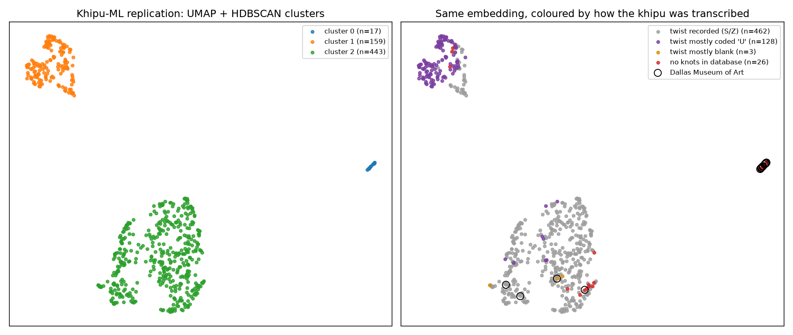

# Study 01: Do machine-learning clusters of khipus measure khipus, or how they were transcribed?

**Status:** complete · **Verdict:** the claim is **not supported**. The structure the model found comes from how the khipus were transcribed, not from the khipus themselves.

## The claim under test

Contreras (2026), *Structural Pattern Mining in Inka Khipus: Unsupervised Clustering, Provenance Classification, and a Computational Validation of the Santa Valley Match*, [arXiv:2607.00185](https://arxiv.org/abs/2607.00185), code at [Khipu-ML](https://github.com/mcontrerasmalpar-pixel/Khipu-ML).

The paper builds 27 structural features for each of the 619 khipus in the Open Khipu Repository (OKR), then applies UMAP and HDBSCAN. It reports:

- three structurally distinct groups (silhouette 0.769);
- a tight 17-khipu cluster of **Inka imperial (Late Horizon)** khipus;
- an XGBoost classifier with **F1 = 0.86 for the Late Horizon imperial style**;
- SHAP analysis naming **cord twist direction** as the main marker of imperial khipus ("S-twist dominates imperial cords, 85.3%").

## Prior work: credit

The confound tested here was first reported by **Steven Fazzio** in [Khipu-ML issue #4](https://github.com/mcontrerasmalpar-pixel/Khipu-ML/issues/4) (6 Sep 2026). This study is an **independent replication** of that critique, with code anyone can re-run. It adds a seed-robustness check and a head-to-head classifier comparison.

## Method

1. Rebuild the paper's 27 features **verbatim** from its published notebook, including its imputation of missing values with 0.
2. Re-run UMAP (`n_neighbors=15`, `min_dist=0.1`) and HDBSCAN (`min_cluster_size=10`, `min_samples=5`) with the published hyperparameters.
3. Describe each khipu using **only transcription completeness**. These 7 variables say nothing about the object itself:
   - does the database contain any cords for it, and any knots?
   - what fraction of twist fields is blank or coded `U` (unknown)?
   - what fraction of cord lengths, knot directions and knot turn counts is missing?
4. Measure how well completeness alone predicts (a) the clusters and (b) the provenance labels, using the paper's own classifier and cross-validation settings.

Data: OKR at a pinned commit, [`4039ca5`](https://github.com/khipulab/open-khipu-repository/tree/4039ca51f4de661d80d0160596309c983a62a9c7).

## Results

### The replication works

| | Paper | This replication |
|---|---|---|
| Cluster sizes | 17 / 160 / 442 | 17 / 159 / 443 |
| Silhouette | 0.769 | 0.788 |
| Late Horizon F1 (27 features) | 0.86 | **0.857** |

The small differences are most likely due to OKR version and library versions.

### 1. Transcription completeness alone predicts the clusters

| Cluster | Size | Has knots in DB | Twist blank | Twist coded `U` | Knot direction coded `U` | Cords with S twist / Z twist |
|---|---|---|---|---|---|---|
| "imperial" | 17 | **18%** | **82%** | 18% | **100%** | **0 / 0** |
| "colonial museums" | 159 | 98% | 1% | **74%** | **74%** | 0.7 / 13.5 per khipu |
| main | 443 | 98% | 1% | 2% | 5% | 93.6 / 2.8 per khipu |

A depth-3 decision tree trained **only on the 7 completeness variables** recovers cluster membership with **91.4%** 5-fold accuracy. The majority-class baseline is 71.6%. Across 10 UMAP seeds this stays at 91.1–91.8% (see `results/seed_robustness.csv`).

The "imperial" cluster contains **zero cords with a recorded S or Z twist**. 14 of its 17 khipus have **no knots in the database**, and 7 have **no cords at all**. The claim that "S-twist dominates imperial cords" therefore cannot come from these khipus: their twist was never recorded.

### 2. "Inka, Late Horizon" is one museum

|  | Dallas Museum of Art | Any other collection |
|---|---|---|
| Labelled "Inka, Late Horizon" | **18** | 0 |
| Any other label | 0 | 601 |

The label and the museum are the same set of khipus. Of those 18, **15 have no knots recorded**.

### 3. The classifier does just as well knowing nothing about the khipu itself

Same XGBoost settings and folds as the paper, on the 135 labelled khipus:

| Features | Weighted F1 (7 classes) | F1 "Inka, Late Horizon" |
|---|---|---|
| Paper's 27 structural features | 0.473 | 0.857 |
| 7 transcription-completeness variables only | 0.393 | **0.875** |
| One binary variable: "are any knots recorded?" | 0.188 | **0.833** |

A model told only whether the database has any knots for a khipu gets almost the same "imperial style" score as the full model.



## Conclusion

The three clusters are three **transcription regimes**: records with twist left blank or no knots, records with twist coded `U`, and fully recorded khipus. The "Inka imperial style" classifier is a **Dallas Museum of Art detector**, and in practice an "empty record" detector.

This does not say anything about whether imperial khipus *are* structurally distinct. It says this dataset and pipeline **cannot show it**. Any such claim needs to:

- drop or explicitly model incomplete records instead of imputing zeros;
- hold out by collection or museum, not by random fold;
- check that the result survives when completeness variables are controlled for.

What stands: the paper's own negative result (knot-type n-grams add no provenance signal) and its observation that one cluster reflects 19th-century museum practice. The Santa Valley recto/verso count is a direct database tally and was not tested here.

## Reproduce

```bash
pip install -r requirements.txt
./scripts/fetch_okr.sh
python studies/khipu/01-khipu-ml-transcription-confound/replicate.py   # ~1 min
```

Outputs are written to `results/`: `summary.json`, `cluster_profile.csv`, `late_horizon_vs_dallas.csv`, `seed_robustness.csv`, `khipu_clusters_completeness.csv`, and the figure.
