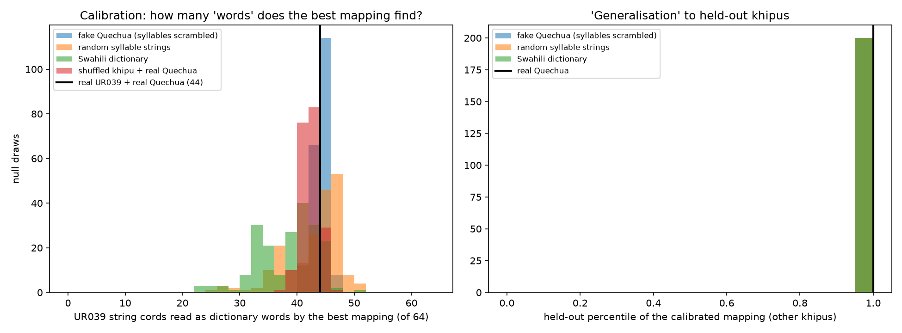

# Study 02: Would the ALBA syllabary search find Quechua in khipus even if there were no Quechua to find?

**Status:** complete · **Verdict:** the calibration evidence is **not diagnostic**. The same search finds just as many "words" in fake Quechua, random syllable strings, a wrong language (Swahili) and shuffled khipus. A high score on held-out khipus is likewise reached by almost every null.

## The claim under test

The claim comes from Sivan (2026), *Reading the Inca Spreadsheet* (preprint), part of the ALBA Project. Its interactive reader is [KhipuReader](https://alba-project.org/khipu-reader/). The project itself calls this a *"proposed decipherment"*.

As published on the project page, the calibration step works like this:

- **Calibration khipu.** One khipu, **UR039** (Huari, about 600–1000 CE), was used. *"Every valid mapping from knot turn counts to Quechua syllables was exhaustively tested: 46,512 candidates, each scored against a 2,067-word Quechua dictionary."*
- **Best mapping.** The best mapping was **L3 = ma, L4 = ka, L5 = ta, L6 = pa**. It *"produced 19 dictionary words"*.
- **Extension.** The syllabary was later extended to 13 knot patterns (16 effective symbols), reported to cover about 97% of "string" cords in the Open Khipu Repository.

The project page itself raises the key risk: Quechua has only about 38 open (consonant + vowel) syllables, so assigning 13 of them to 13 knot types *"will inevitably hit real words"*.

## What we could and could not access

- **Not accessible.** The ALBA code and dictionary were not reachable from our environment.
- **What we rebuilt.** The **calibration logic** was rebuilt from the published description.
- **What this means.** We test the *method*, i.e. whether "the best mapping produces N dictionary words" is evidence at all. We do **not** re-score ALBA's exact mapping against ALBA's dictionary.

## Method

**Data.** The Open Khipu Repository at pinned commit `4039ca5`.
- *String cords:* cords carrying **two or more long knots**. A valid decimal cord has at most one long knot, so these cannot be ordinary numbers.
- *Calibration set:* UR039 has 64 string cords, all built from L3–L6, forming 19 distinct patterns.
- *Held-out set:* 632 string cords on 78 other khipus that use only L3–L6.

**Dictionary.**
- *Source:* Quechua (Ayacucho) headwords from the MINEDU dictionary, as distributed by AmericasNLP 2021.
- *Normalisation:* 5-vowel spellings are mapped onto /a i u/.
- *Filtering:* we keep only words of two or more syllables that can be written entirely in open syllables, since no other word can ever be produced by a knot-to-syllable mapping. This leaves **434 words**, out of 2,417 single-word entries.

**Search.** Every injective mapping of {L3, L4, L5, L6} to syllables, in two spaces:
- `Ca_syllables`: every consonant + *a* syllable. 16 candidates give **43,680 mappings**, close to ALBA's 46,512.
- `all_CV_syllables`: 16 consonants × 3 vowels, plus bare vowels. 51 candidates give **5,997,600 mappings**.

**Score.** The number of UR039 string cords whose full reading is a dictionary word. Ties are broken by the number of distinct words.

**Null models.** The *whole* calibration (exhaustive search, then the best mapping) is re-run on each null:

| Null | What it keeps | What it destroys |
|---|---|---|
| Fake Quechua | the same words with their syllables shuffled | real Quechua words |
| Random syllable lexicon | Quechua syllable frequencies and word-length distribution | all words |
| Swahili | same size and **same word-length distribution** as the Quechua lexicon; also a CV-syllabic language | Quechua |
| Shuffled khipu | real dictionary; UR039's knots and cord lengths | knot order and grouping on cords |

**Held-out test.** For each calibrated mapping we measure what share of all candidate mappings it beats on the held-out cords. In the large space this is measured against a fixed random sample of 200,000 mappings. We then ask how often a *null* calibration also lands at the 95th percentile or higher.

## Results

### Space `Ca_syllables` (43,680 mappings, 200 draws per null)

| Calibration data | Best mapping: UR039 cords read as words (of 64) | p (null ≥ real) |
|---|---|---|
| **Real Quechua + real UR039** | **44** (7 distinct words; best mapping L3 = cha, L4 = qa, L5 = ya, L6 = pa) | — |
| Fake Quechua (scrambled syllables) | mean 43.5 (range 41–47) | 0.61 |
| Random syllable lexicon | mean 42.4 (range 25–51) | 0.56 |
| Swahili (length-matched) | mean 37.9 (range 23–50) | 0.13 |
| Shuffled khipu + real Quechua | mean 41.9 (range 37–46) | 0.15 |

Held-out "generalisation":
- *Real Quechua:* the calibrated mapping beats 100% of mappings on the 78 other khipus.
- *Fake Quechua, random lexicon, Swahili:* **100%** of null calibrations also reach the 95th percentile or higher (medians 0.998–0.9996).



### Space `all_CV_syllables` (6.0 M mappings, 40 draws per null)

| Calibration data | Best mapping: UR039 cords read as words (of 64) | p (null ≥ real) |
|---|---|---|
| **Real Quechua + real UR039** | **46** (8 distinct words; best mapping L3 = ki, L4 = si, L5 = chi, L6 = pi) | — |
| Fake Quechua (scrambled syllables) | mean 45.8 (range 44–47) | 0.78 |
| Random syllable lexicon | mean 46.9 (range 39–53) | 0.93 |
| Swahili (length-matched) | mean 45.7 (range 42–52) | 0.56 |
| Shuffled khipu + real Quechua | mean 43.5 (range 41–46) | 0.07 |

Held-out: **100%** of null calibrations in every lexical null reach the 95th percentile or higher. Held-out percentiles here are measured against a fixed sample of 200,000 mappings.

A larger search space finds *more* "words" for every lexicon: Swahili rises from 37.9 to 45.7. Random syllable strings now do slightly *better* than real Quechua.

**The one null that comes close to significance is the shuffled khipu** (p = 0.07; 0.15 in the smaller space). It says that UR039's real arrangement of knots yields slightly more readable cords than a random rearrangement. The likely reason is repetition rather than language:
- UR039 concentrates its cords on a few patterns (`L5 L4` alone appears 14 times).
- A mapping that makes one frequent pattern a word therefore scores many cords at once.
- Shuffling spreads the knots over more distinct patterns.

Either way, the lexical nulls show this structure is equally "readable" as fake Quechua, random syllables or Swahili.

### Reading direction control (`--reverse`, space `Ca_syllables`, 200 draws)

Knots are read from the primary cord downwards by default. In 99.8% of OKR cords with two or more knot clusters, the cluster ordinal increases away from the primary cord, which is the direction in which khipu numbers are read. Reading every cord **bottom-to-top** instead should break a genuine syllabic channel.

| Calibration data | Top-down (default) | **Bottom-up (reversed)** |
|---|---|---|
| Real Quechua + real UR039 | 44 (best mapping L3 = cha, L4 = qa, L5 = ya, L6 = pa) | **43** (best mapping L3 = pa, L4 = ya, L5 = qa, L6 = cha) |
| Fake Quechua | 43.5 (p = 0.61) | 43.4 (p = 0.81) |
| Random syllable lexicon | 42.4 (p = 0.56) | 42.4 (p = 0.62) |
| Swahili (length-matched) | 37.9 (p = 0.13) | 38.0 (p = 0.20) |
| Shuffled khipu | 41.9 (p = 0.15) | 41.9 (p = 0.33) |

Read backwards, the search finds just as many "Quechua words". It uses the same four syllables, assigned to the knot types in mirror order, and the held-out percentile is again 1.0. A calibration that is indifferent to reading direction cannot be evidence of a phonetic reading.

## Why this happens

UR039's 64 string cords collapse into **19 short patterns** of 2–3 knots, dominated by L4 and L5 (e.g. `L5 L4` × 14, `L4 L4` × 10, `L5 L5` × 9). Choosing four syllables to make a handful of two-syllable patterns into words is easy in any lexicon rich in CV-CV words.

Held-out khipus repeat the **same few patterns**:
- 90% of the 632 held-out string cords are 2–3 knots long.
- The most common held-out patterns are `L4 L4` (54), `L5 L4` (48) and `L5 L5` (37).
- **49%** of held-out cords carry a pattern that also occurs on UR039.

So any mapping chosen to make `L5 L4` a word on UR039 also scores well everywhere else. Calibration and "validation" are not independent tests.

## Conclusion

- **The calibration result is not evidence.** That an exhaustive search over syllable mappings finds many dictionary words on UR039 does not distinguish Quechua from fake Quechua, random syllables, Swahili, or a shuffled khipu.
- **The held-out result is not evidence either.** A calibrated mapping scoring at the 99th percentile on other khipus is what the null models produce too.
- **What is untested.**
  - ALBA's exact dictionary, its full 13-symbol syllabary, position-dependent alternations, and its semantic-coherence judgement of the readings.
  - Those extra degrees of freedom would, if anything, make chance fits easier.
  - The semantic judgement is the part that would need a blinded test: readers scoring real versus null-mapping readings without knowing which is which.
- **What a convincing test would look like.**
  - Fix the mapping **before** looking at a khipu whose content is known independently, for example the colonial-document matches from the Santa Valley.
  - Show that it recovers that content better than null mappings do.

## Reproduce

```bash
uv sync
./scripts/fetch_okr.sh && ./scripts/fetch_lexicons.sh
uv run python studies/khipu/02-alba-syllabary-null-test/null_test.py --space Ca_syllables --draws 200      # ~2 min
uv run python studies/khipu/02-alba-syllabary-null-test/null_test.py --space all_CV_syllables --draws 40   # ~30 min
uv run python studies/khipu/02-alba-syllabary-null-test/null_test.py --space Ca_syllables --draws 200 --reverse  # ~2 min
```

Outputs are written to `results/`: `summary_<space>[_reversed].json`, `null_draws_<space>[_reversed].csv` and `null_distributions_<space>[_reversed].png`.
