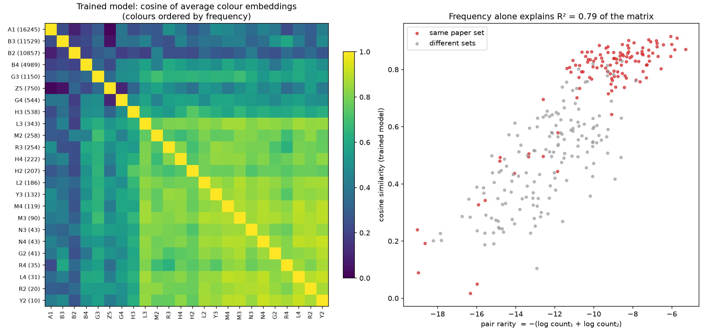

# Study 03: Does the khipu colour BERT learn colour meaning, or colour identity and frequency?

**Status:** complete (tests 3a and 3b; retraining on shuffled data not run) · **Verdict:** the headline structure is **largely reproduced without training** or **explained by colour frequency**. Separately, the published checkpoint does **not** reproduce the published embeddings.

## The claim under test

The study tested here is Clindaniel, *"Colorful Insights from an AI Khipukamayuq"* (SocArXiv preprint, 2024). Code and data are at [jonclindaniel/colorful-ai-khipukamayuq](https://github.com/jonclindaniel/colorful-ai-khipukamayuq) (MIT, commit `41cde6e`).

**The model.** A BERT model (default `BertConfig`, about 110 M parameters) is trained from scratch with masked-language modelling. Its "text" is the sequences of cord colours in the cord groups of OKR v2.0.0: 6,592 groups and 48,636 colour tokens across 24 KCCS colour codes. Each cord's contextual embedding is the concatenation of the last four layers (3,072 dimensions).

**The analysis notebook reports:**
1. **Distinct semantic domains.** Colours fall into distinct clusters (UMAP to 100 dimensions with cosine distance, then HDBSCAN with `min_cluster_size=250`). 79% of cords are clustered, and most common colours own their own cluster(s).
2. **Polysemy.** Common colours split across several clusters. Within-colour cosine histograms are read as monosemy, polysemy or homonymy, with **0.5** as the monosemy threshold and peaks above 0.9.
3. **Three colour sets.** The cosine similarity of average colour embeddings defines:
   - a *foundational* set {A1, B2, B3, Z5};
   - an *extension* set {B4, G3, G4, H3, M2};
   - a *refinement* set of 15 rare colours, *"all highly related to one another (perhaps relating to a highly specialized semantic domain)"*.

   The notebook notes that these sets *"roughly correspond to usage percentages"*.

## Method

1. **Rebuild the cord-group sequences** from OKR v2.0.0, using the notebook's SQL verbatim.
   - The colour-token counts match the paper exactly for all 24 colours (A1 16,245; B3 11,529; B2 10,857; …).
2. **Compute contextual embeddings** with two models:
   - the **published trained checkpoint**;
   - the **same architecture with random weights**, seeded and never trained. This is the control: whatever the untrained model also produces cannot be evidence of learned meaning.
3. **Run the notebook's cord-level pipeline** on both, with identical parameters: jitter, UMAP (100-d, cosine, `min_dist=0`, seed 7), then HDBSCAN (`min_cluster_size=250`).
4. **Compare frequency with similarity.** Test how much of the between-colour similarity matrix, and of the three sets, is predicted by colour frequency alone.

## Results

### 0. The published checkpoint does not reproduce the published embeddings

The repository ships pre-computed embeddings, and the paper's figures are built from them (`USE_PRECOMPUTED = True`). We checked four colours: M3, Y2, R2 and L4. For each we ran the same cord groups, with identical token ids, through the published checkpoint.

| Colour | Tokens | Median cosine: checkpoint vs published embedding |
|---|---|---|
| M3 | 90 | 0.006 |
| Y2 | 10 | 0.062 |
| R2 | 20 | 0.016 |
| L4 | 31 | 0.008 |

**What we ruled out:**
- *Loading errors.* The weights load with no missing, unexpected or mismatched keys.
- *Library versions.* The result is identical under `transformers` 4.46 and 5.18.
- *An untrained checkpoint.* It reaches MLM loss 1.96 on the published test split; its own log reports 1.88 at step 400, and a random model would be around 10.

The published embeddings have the statistics of a trained model (see below), just not *this* one. The most likely explanation is a different training run. Exact numerical replication of the paper's figures from the released model is therefore not possible. The comparisons below re-run the method on the released checkpoint.

### 1. Distinct per-colour clusters appear without any training

| Cord-level clustering | Trained checkpoint | **Random weights** |
|---|---|---|
| Clusters (HDBSCAN, min size 250) | 23 | **60** |
| Colour tokens in a cluster | 77% (paper: 79%) | **83%** |
| Cluster purity (share of the majority colour) | 0.98 | **0.94** |
| Colours that are the majority of at least one cluster | 10 | **9** |
| NMI (colour vs cluster) | 0.84 | 0.54 |

An untrained network already separates colours into their own clusters, because it separates **token identities**. It also splits each colour into *more* clusters (60 vs 23). Several clusters per colour is what the paper reads as polysemy, and here it arises with no learning at all.

### 2. The monosemy threshold does not discriminate

All **24 of 24** colours have a median within-colour cosine above the 0.5 monosemy threshold, in **both** models:

| | Trained | Random |
|---|---|---|
| Range of per-colour median within-colour cosine | 0.75–0.93 | 0.73–0.79 |

High cosine similarity is a property of transformer embedding spaces (anisotropy), not evidence about meaning. The values the paper treats as meaningful need a calibrated baseline, such as the random-weight model.

### 3. The three colour sets are frequency tiers



- **The sets match frequency tiers.** Ranking colours by frequency and cutting at the paper's set sizes (4 / 5 / 15) reproduces the paper's assignment for **20 of 24 colours** (adjusted Rand 0.65). The only differences are swaps of neighbours in the ranking: B4 ↔ Z5 and L3 ↔ M2.
- **Frequency explains most of the similarity matrix.** It accounts for **R² = 0.79** of the trained model's between-colour cosine matrix, using two pairwise terms: overall rarity, and the difference in frequency.
- **The frequency effect comes from training.** For random weights the same R² is 0.004.
- **The "highly related" refinement set is the rarity effect.** Its 15 rare colours have mean pairwise cosine **0.83**, versus **0.33** among the other colours. In the random model both are about 0.73.

The model was trained for only 400 steps of 4 sequences (about 24 passes over 68 training chunks). In that regime, rare tokens receive little training signal, which plausibly explains why they end up with similar representations. The paper reads this as a specialised semantic domain.

## Conclusion

- **The paper's distinctions are mostly not evidence of colour semantics.**
  - Separate per-colour clusters, several clusters per colour, and above-threshold within-colour similarity all appear in an **untrained** network.
  - The three colour sets are, to within two neighbour swaps, **frequency tiers**.
  - The tight similarity of rare colours is what an under-trained model does with rare tokens.
- **What training does add** is a between-colour similarity structure that differs from random (Spearman 0.12 between the trained and random matrices). Most of that structure (R² 0.79) is predicted by frequency.
- **Not tested:**
  - the cord-group "phrase" clusters (127) and khipu-level "topic" clusters (20);
  - Ascher-code sub-cluster analyses;
  - **retraining on shuffled colour sequences** (planned 3c). This would show whether *any* learned similarity survives once co-occurrence structure is destroyed, and needs several CPU hours per run.
- **What a stronger claim would need:**
  - a random-weight and a shuffled-data baseline for every reported statistic;
  - frequency-matched comparisons;
  - several training seeds, given that two training runs evidently produce near-orthogonal embedding spaces.

## Reproduce

```bash
uv sync --group bert                     # adds torch + transformers (large download)
./scripts/fetch_clindaniel.sh            # pinned code, checkpoint (438 MB, sha256-checked), OKR v2.0.0
uv run --group bert python studies/khipu/03-color-bert-random-init-control/embed.py --model trained   # ~8 min CPU
uv run --group bert python studies/khipu/03-color-bert-random-init-control/embed.py --model random --seed 0
uv run --group bert python studies/khipu/03-color-bert-random-init-control/analyze.py                 # ~20 min
uv run --group bert python studies/khipu/03-color-bert-random-init-control/frequency_test.py
```

Embeddings (about 1.2 GB) are written to `data/derived/study03/` and not committed. Committed outputs are in `results/`:
- `summary.json`
- `frequency_summary.json`
- `within_colour_cosine.csv`
- `between_colour_cosine_{trained,random}.csv`
- the figure
